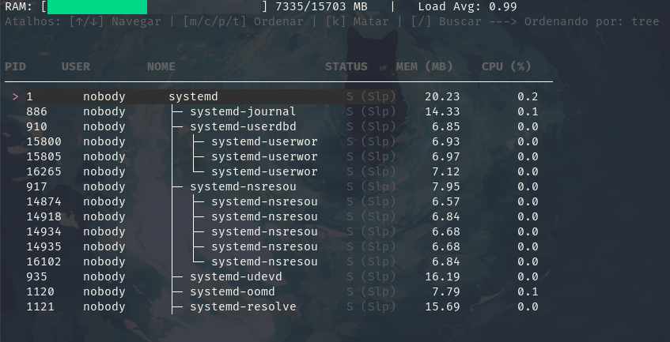

# 🔥 SudoSee

**SudoSee** é um monitor de tarefas e processos do sistema interativo para terminal (TUI), desenvolvido inteiramente em **Go**. Inspirado em ferramentas clássicas como `htop` e `btop`, ele foi construído do zero lendo diretamente os dados do Kernel Linux (`/proc`), sem depender de chamadas externas de sistema.

Este projeto foi desenhado para ser uma ferramenta rápida, bonita e prática, mas também serve como um estudo de caso profundo sobre **Arquitetura de Software**, **Concorrência** e **Design de Interfaces para Terminal**.



## ✨ Funcionalidades

* **Monitoramento em Tempo Real:** Atualização contínua de uso de CPU, Memória e Status dos processos.
* **Dashboard Global:** Visualização gráfica do uso de RAM total/disponível e Load Average do sistema.
* **Visão em Árvore (Tree View):** Mapeamento hierárquico instantâneo de processos pais e filhos (PPID).
* **Busca Instantânea:** Filtro de processos em tempo real com barra de pesquisa interativa.
* **Interação Direta:** Encerramento de processos (SIGKILL) diretamente pela interface.
* **Identificação de Usuário:** Tradução automática de UIDs para nomes de usuários reais via cache do `/etc/passwd`.

## 🏗️ Engenharia e Arquitetura

O grande diferencial do SudoSee está sob o capô. O código foi estritamente guiado por princípios fundamentais de engenharia de software para garantir que a base seja simples de entender, fácil de manter e altamente escalável.

* **Clean Architecture & SOLID:** O projeto é estritamente dividido em camadas (Domain, UseCases e Adapters). A regra de negócio não faz ideia de que os dados vêm do `/proc` ou que estão sendo renderizados pelo Bubble Tea.
* **Single Responsibility Principle (SRP):** Cada arquivo tem um propósito único. A interface visual, por exemplo, é componentizada (`model`, `view`, `update`, `styles`), isolando estado, comportamento e renderização gráfica.
* **KISS (Keep It Simple, Stupid) & DRY (Don't Repeat Yourself):** Sem abstrações desnecessárias. Constantes do sistema (como tamanho de página de memória) e arquivos estáticos (como usuários) são cacheados na inicialização do repositório para evitar I/O redundante em disco.
* **Concorrência de Alta Performance:** A leitura dos arquivos do sistema (`/proc/[pid]/stat`) não é sequencial. O SudoSee utiliza **Goroutines**, `sync.WaitGroup` e `sync.Mutex` para varrer centenas de processos no disco simultaneamente, reduzindo o tempo de I/O a milissegundos e garantindo que a TUI nunca engasgue.

## 🛠️ Tecnologias Utilizadas

* **[Go (Golang)](https://go.dev/):** Linguagem principal.
* **[Bubble Tea](https://github.com/charmbracelet/bubbletea):** Framework robusto para interfaces de terminal (padrão arquitetural Elm).
* **[Lipgloss](https://github.com/charmbracelet/lipgloss):** Motor de estilização visual (CSS para o terminal).
* **[Bubbles](https://github.com/charmbracelet/bubbles):** Componentes de UI (usado para o TextInput de busca).

## 🚀 Como Executar

### Pré-requisitos
* Sistema Operacional Linux (ou WSL).
* Go 1.21+ instalado.

### Instalação

Clone o repositório:
```bash
git clone [https://github.com/VictorMoura00/sudosee.git](https://github.com/VictorMoura00/sudosee.git)
cd sudosee
```
Você pode executar diretamente via Makefile:

```Bash
make run
```
Ou compilar o projeto gerando um binário super leve na pasta bin/:

```Bash
make build
./bin/sudosee
```

## ⌨️ Teclas de Atalho

A navegação foi projetada para ser rápida e acessível diretamente pelo teclado:

| Tecla | Ação |
| :--- | :--- |
| `↑` / `↓` | Navegar pela lista de processos (com Auto-Scroll). |
| `m` | Ordenar processos pelo maior uso de **Memória**. |
| `c` | Ordenar processos pelo maior uso de **CPU**. |
| `p` | Ordenar processos por **PID** (Ordem de criação). |
| `t` | Alternar para a **Visão em Árvore** (Hierarquia). |
| `/` | Abrir a barra de **Busca/Filtro** (Pressione `Enter` ou `Esc` para sair). |
| `k` | **Matar (Kill)** o processo selecionado no cursor. |
| `q` ou `Ctrl+C` | Sair do SudoSee graciosamente. |


## 🤝 Contribuição

Sinta-se livre para abrir Issues ou enviar Pull Requests. Toda melhoria arquitetural ou nova funcionalidade será muito bem-vinda!